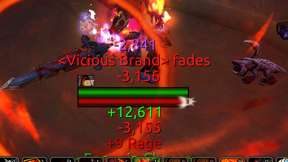

# 📛 Nameplate Aura Manager

This World of Warcraft addon manages aura visibility on default player and enemy nameplates.

## Features

- Customizes which auras are visible on player and enemy nameplates.
- Separate management for buffs (player nameplate) and debuffs (enemy nameplate).
- Uses game default settings if no custom lists are provided.

## Class Defaults

- Currently, only Warriors and Hunters have pre-defined default lists.
- Other classes will use the game's default settings until customized.

## Usage

- `/nam allowbuff [spellId]` to toggle an allowed aura on the player nameplate.
- `/nam blockbuff [spellid]` to toggle a blocked aura on the player nameplate.
- `/nam allowdebuff [spellId]` to toggle an allowed debuff on the enemy nameplate.
- `/nam blockdebuff [spellId]` to toggle a blocked debuff on the enemy nameplate.
- `/nam list` to display class allow and block lists.
- `/nam clear` to clear class allow and block lists.
- `/nam reset` to reset class allow and block lists to default.

## Finding Spell IDs

You can find spell ID in aura tooltip with [idTip](https://github.com/ItsJustMeChris/idTip-Community-Fork) or find on [wowhead](http://wowhead.com/spell).

## Screenshots

