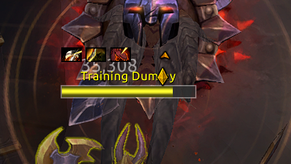
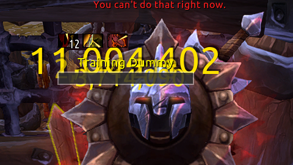

# Nameplate Aura Manager

World of Warcraft addon: Change which auras show on default nameplate.

## Usage

- `/nam allow [spellId]` to toggle an allowed aura.
- `/nam block [spellId]` to toggle a blocked aura.
- `/nam list` display class allow and block lists.
- `/nam reset` reset class allow and block lists to default.

Can see debuff spellId in tooltip with <https://www.curseforge.com/wow/addons/idtip-community-fork> or find on <http://wowhead.com/spell>.
